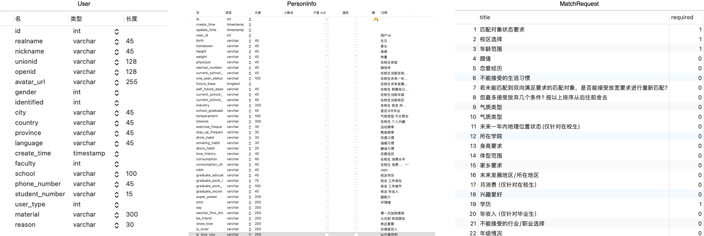
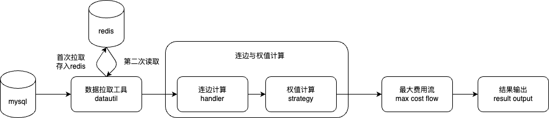

# 匹配算法

## 业务描述

### 场景

将匹配池子分为两个列表（男生列表和女生列表），参与匹配的每个用户定义为MatchUser，包含如下信息：

```java
class MatchUser {
  User user; // 用户
  PersonInfo personInfo; // 个人信息
  MatchRequest matchRequest; // 匹配问卷
  Integer appearence; // 颜值
  Integer lucky; // 幸运值
}
```



- User：包含用户的注册信息（ID、姓名、学号、性别、学院等信息）
- PersonInfo：包含用户的个人信息（家乡、身高、体重、校区等等）
- MatchRequest：问卷信息（包含各种匹配问题及其回答，下面仅包含问题部分）
- Appearence：系统给的颜值打分
- Lucky：系统幸运值

### 匹配目标

- 当男女互相符合对方匹配问卷时，可以成为一个匹配对。

- 每个用户只能匹配一个用户。

- 针对平台：输出**最大化**匹配对数（平台收益最大化）。
- 针对用户：尽可能为每个用户匹配**"最合适"**的人选。

## 算法架构



- Mysql：数据全部存储在Mysql中，需要从Mysql中拉取数据。

  1. 查询User（与user_activity联表，校验是否参与了活动）

  2. 查询PersonInfo。
  3. 查询MatchRequest（查询好多张问卷相关表）。
  4. 查询Appearence颜值表。
  5. 查询Lucky幸运值表。
  6. 组装信息，返回结果。

- Redis

  - 由于每次匹配从库中拉取数据非常慢（1H），所以考虑直接将组装好的数据MatchUser存入Redis。
  - 第二次重新取数据直接从Redis中拿。
  - 后续仔细思考了一下，获取数据的时候，也可以做并发读，也可以不用redis，存储到本地即可。

- DataUtil

  - 拉取数据的工具类，包含历史匹配数据、问卷名字表、从数据库中查询MatchUser、Redis写入、读取与删除工具

- 连边计算

  - 统计男女双方是否双向匹配（满足必选条件）。

  - MatchUser经过一个handler集合（主要包含必选条件、可选条件）

    - 如果男生符合女生必选条件，计算并返回not_match_num1（未满足可选要求的数量）， 否则返回-1。

    - 如果男生符合男生条件，计算并返回not_match_num2（未满足可选要求的数量），否则返回-1。

      > 注意这里的not_match_num1和not_match_num2会被用来做权值的扣分

    - 如果只要一方不符合（-1），则两者之间没有边。

- 权值计算

  - 统计男女双方匹配程度（权值），权值分为以下几个部分组成

    - 初始化分数：100

    - 可选要求中未满足数量：not_match_num1+not_match_num2

    - 系统权值匹配分：包含颜值、家乡、未来发展地、一年内状态、消费水平、消费分担、兴趣爱好、运动频率、熬夜频率、身高、年龄在内的系统权值计算规则

      https://tnh0kmeq9n.feishu.cn/wiki/wikcnXWSGCUzNzUYgU8vXiV8tXe

  - 赋分规则为：初始化分数 + 系统权值匹配分 - 可选要求中未满足数量

- 最大费用流

  - 核心算法，在满足限制条件（一个人只能匹配一个人）的前提下，找到最大匹配对，使得总分数或总收益最大化。

- 结果输出

  - 匹配失败报告
  - 匹配成功对数
  - 幸运值加减等后续业务

## 算法的演进

### 手工时代 
- 时间 21.10～21.11

起源于创业课程项目，简单的问卷，手工匹配，比较容易出错，小步验证。

### 匈牙利算法
- 时间 21.12-22.05

最简单的二分图匹配算法，不带权重。

### KM算法
- 时间 22.05-22.12

迭代了问卷系统，小程序上线，使用KM算法，加上权重的匹配。

### 费用流算法
- 23.01-至今

做进系统，自动化，使用费用流算法，方便后续扩展。

## 后续的规划


## TODO
- [ ] KM算法/最大费用最大流细节了解。
- [ ] 基于业务数据，优化问卷权重配比，如何做？
- [ ] 除了匈牙利/KM/最大费用最大流，还有什么算法可以用？
- [ ] 问一问大模型，把整个链路丢进去，看看有什么值得优化的点。
